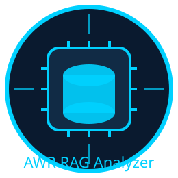

  

# 📘 AWR Miner RAG Analyzer
AWR Miner RAG Analyzer adalah tool modern untuk menganalisis performa Oracle Database menggunakan pendekatan Retrieval-Augmented Generation (RAG).
Program ini menggabungkan:
- Parsing AWR Miner
- Pandas DataFrame processing
- Redis VectorStore
- LM Studio (LLM + Embedding)
- Prompting engine Oracle‑like
- Laporan performa otomatis yang lengkap dan profesional
Hasil akhirnya adalah laporan AWR yang lebih mudah dibaca, lebih informatif, dan lebih actionable dibandingkan laporan AWR standar.

# 🚀 Fitur Utama
## 🔍 Parsing AWR Miner Output
Program membaca file teks AWR Miner (~~BEGIN-...~~ / ~~END-...~~) dan mengubahnya menjadi DataFrame:
- OS-INFORMATION
- MEMORY
- MAIN-METRICS
- AVERAGE-ACTIVE-SESSIONS
- TOP-N-TIMED-EVENTS
- TOP-SQL-BY-SNAPID
## 🧹 Normalisasi & Konversi Tipe Data
- SNAP_ID → integer
- durasi snapshot → integer
- timestamp snapshot (end) → datetime (%y/%m/%d %H:%M)
- perhitungan start_time otomatis
## 🧠 Super-Documents (RAG Context)
Program membuat dua jenis superdocs:
- Snapshot Superdocs → per SNAP_ID
- Hourly Superdocs → agregasi per jam
Setiap superdoc berisi:
- CPU & workload
- AAS
- Wait events
- Top SQL
- I/O
- RAC / GC
- Memory
- Timestamp lengkap
## 🗄️ Redis VectorStore
Semua superdocs di‑embedding dan disimpan ke Redis untuk semantic search.
## 🤖 RAG Report Generator
Menggunakan LM Studio (OpenAI-compatible API) untuk menghasilkan laporan:
- Executive Summary
- Ringkasan Status (Sehat / Peringatan / Kritis)
- Temuan Utama
- CPU Trend Analysis
- Wait Event Analysis
- AAS Trend Analysis
- I/O Analysis
- RAC Analysis
- Top SQL Analysis
- Akar Masalah (Root Cause)
- Rekomendasi Tindakan
## 📝 Prompting Engine Oracle-like
Prompt dapat dikustomisasi:
- --analysis-level → executive / technical / deepdive
- --recommendation-level → high / medium / expert
- --language → id / en
- --style → hybrid
- --preset → manager / dba / expert / balanced / english
## 📄 Output Report Profesional
Header laporan berisi:
- Database name
- DBID
- Platform
- Oracle version
- CPU & memory
- Instance count
- Rentang waktu snapshot
- Rentang SNAP_ID
Nama file otomatis:
{dbname}_{dbid}_{start}_{end}_awr_rag_output.txt

# 📦 Instalasi
1. Clone repository
git clone https://github.com/yourrepo/awr-rag-analyzer.git
cd awr-rag-analyzer

2. Install dependencies

    pip install -r requirements.txt

3. Pastikan Redis berjalan (redis stack)
    
    redis-server

4. Pastikan LM Studio berjalan
- Load model LLM (misal: Llama 3.1 8B Instruct)
- Load embedding model (bge-base)
- Pastikan API port 1235 aktif

# 🧪 Cara Menggunakan
🔹 Ekstrak semua section AWR Miner
        
        python awrextractor.py awr-hist.out --csv-all --outdir out_sections

🔹 Jalankan full RAG pipeline
Parse → ingest → generate report:

    python awrextractor.py awr-hist.out --rag-run-all --save out_reports

🔹 Gunakan preset

    python awrextractor.py awr.out --rag-run-all --preset manager

    python awrextractor.py awr.out --rag-run-all --preset expert

🔹 Custom prompting

    python awrextractor.py awr.out \
        --rag-run-all \
        --analysis-level deepdive \
        --recommendation-level expert \
        --language en

🔹 Help

Command dan option lengkap:

    py .\awrextractor.py --help
    usage: awrextractor.py [-h] [--section SECTION] [--outdir OUTDIR] [--csv] [--csv-all] [--excel]
                           [--excel-filename EXCEL_FILENAME] [--verbose] [--rag-ingest]
                           [--rag-report-snap RAG_REPORT_SNAP] [--instance INSTANCE]
                           [--rag-report-range RAG_REPORT_RANGE RAG_REPORT_RANGE] [--rag-ask RAG_ASK [RAG_ASK ...]]
                           [--rag-report-all] [--rag-run-all] [--save SAVE]
                           [--analysis-level {executive,technical,deepdive}] [--recommendation-level {high,medium,expert}]
                           [--language {id,en}] [--style {hybrid}] [--preset {manager,dba,expert,balanced,english}]
                           INPUT

    positional arguments:
      INPUT                 Input file path or name (required). If a path is provided it will be used; otherwise the
                            filename is resolved relative to the current working directory.

    options:
      -h, --help            show this help message and exit
      --section SECTION, -s SECTION
                            Only extract this named section
      --outdir OUTDIR, -o OUTDIR
      --csv                 Write CSV for extracted sections
      --csv-all             Write CSV for all sections
      --excel               Write all sections to a single Excel file
      --excel-filename EXCEL_FILENAME
                            Excel output filename (default: awr_extracted_sections.xlsx)
      --verbose, -v         More detialed output
      --rag-ingest          Ingest parsed DataFrames into Redis for RAG
      --rag-report-snap RAG_REPORT_SNAP
                            Generate RAG report for a specific SNAP_ID (after ingestion)
      --instance INSTANCE   Instance number for snapshot report
      --rag-report-range RAG_REPORT_RANGE RAG_REPORT_RANGE
                            Generate RAG report for a range of SNAP_ID (after ingestion)
      --rag-ask RAG_ASK [RAG_ASK ...]
                            Ask any question to the RAG system (after ingestion)
      --rag-report-all      Generate RAG report for the entire file (auto min/max SNAP_ID) (after ingestion)
      --rag-run-all         Parse → ingest → generate full-range RAG report in one execution
      --save SAVE           Save RAG output to a text file
      --analysis-level {executive,technical,deepdive}
      --recommendation-level {high,medium,expert}
      --language {id,en}
      --style {hybrid}
      --preset {manager,dba,expert,balanced,english}
                            Gunakan preset konfigurasi prompting

# 🧩 Struktur Program

1. awrextractor.py

- Parsing AWR Miner text file
- Konversi tipe data
- Normalisasi kolom
- Ekspor CSV
- RAG ingestion
- RAG full pipeline
- Penentuan SNAP_ID range
- Penentuan nama file output

2. awr_rag.py

- Pembuatan superdocs (snapshot & hourly)
- Sanitasi numeric
- Embedding (LM Studio)
- Redis VectorStore
- RAG chain (range report, snapshot report, QA)
- SQL trend analysis

3. prompting.py

- Membangun system prompt
- Menentukan struktur laporan
- Menentukan level analisis & rekomendasi
- Menambahkan aturan timestamp
- Menentukan gaya hybrid (AWR + ADDM + AI Insight)

👤 Author

- Muhamad Irvansyah (Cunkrink) — Creator & Lead Developer
- Microsoft Copilot — AI collaborator for design, prompting, and architecture refinement

# 📜 License

Program ini dirilis di bawah lisensi:
GNU General Public License v3.0 (GPL-3.0)

# 🏁 Penutup

AWR Miner RAG Analyzer adalah tool modern yang menggabungkan kekuatan:
- Oracle AWR
- Pandas
- Redis
- LM Studio
- Prompt engineering
Hasilnya adalah laporan performa Oracle yang:
- lengkap
- akurat
- mudah dibaca
- dapat dikustomisasi
- dan jauh lebih informatif daripada AWR standar
